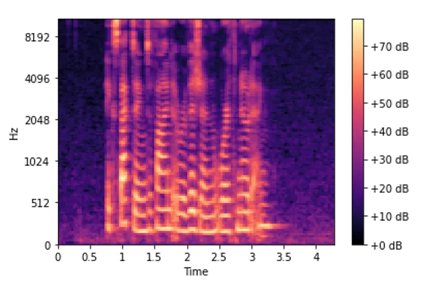
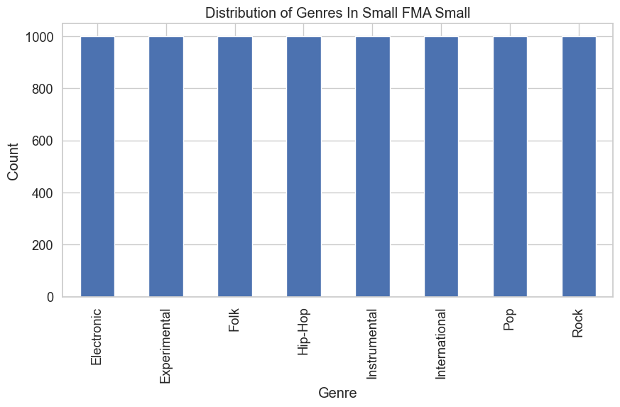
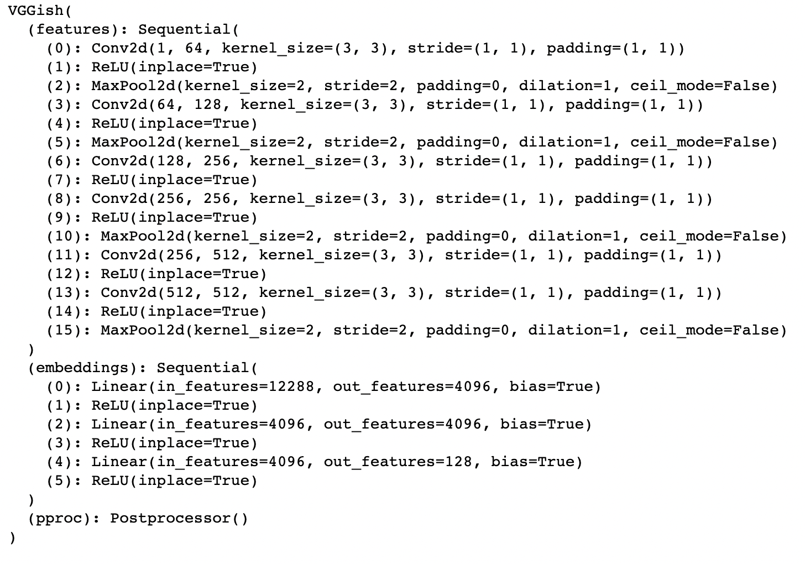
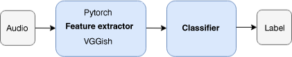
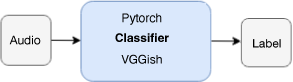
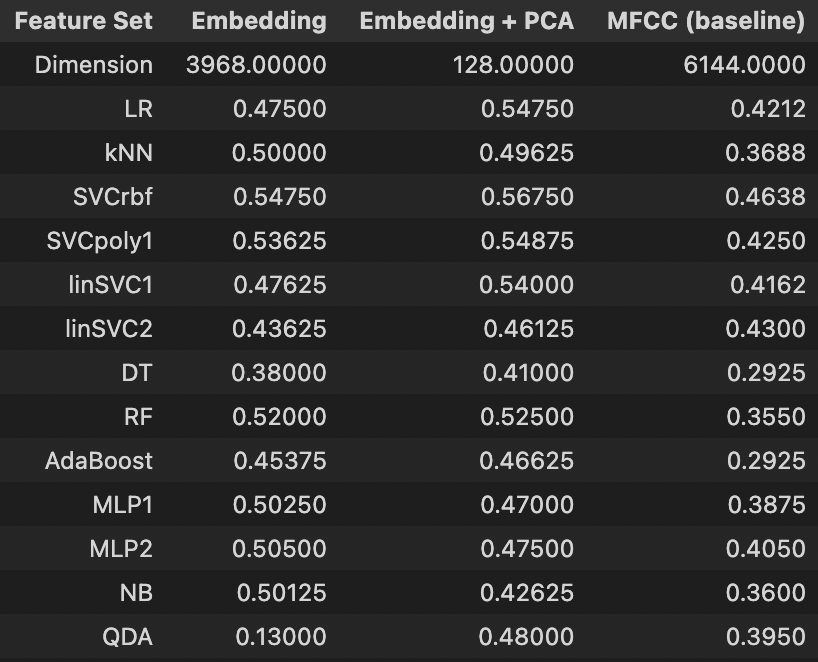
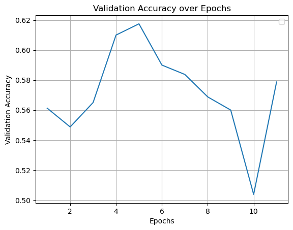

# Genre_Pred
This project was done in collaboration with Jeffrey Kuo, Bryan Wang, and Tessa Weiss at the University of California, Berkeley for Stat 254. Please note that the following is a simplified overview, and further information can be found in [Method_Details.pdf](https://github.com/Ttantivi/genre_pred/blob/main/Method_Details.pdf)

This project builds upon the work of [fma](https://github.com/mdeff/fma) and [torchvggish](https://github.com/harritaylor/torchvggish).

## Introduction and Results Preview
This project explores the use of transfer learning on Convolutional Neural Networks (CNNs) to predict the genre of a song using mel-spectrograms. We employed Google's [VGGish](https://github.com/tensorflow/models/tree/master/research/audioset/vggish) CNN architecture, which was ported to PyTorch, and trained the model using the Free Music Archive (FMA) small dataset. The objective was to predict the genre of a song given a raw mp3 file and improve upon the baseline accuracies presented in the original FMA analysis. Our findings show that transfer learning with CNNs on mel-spectrograms can accurately predict song genre with a relatively high degree of accuracy, achieving an accuracy of 56.75%, a 7.75 percentage point improvement. 

This READEME outlines the conceptual baseline of how the CNN utilizes the mel-spectrogram, data description, model architecture and training, results, and next steps.

### Motivation
Automatic genre prediction is an important problem in the music information retrieval (MIR) space. Having an accurate genre prediction model is useful for building music recommender systems. On platforms such as Spotify and Apple Music, being able to accurately predict the genres that a user listens to allows us to recommend songs of the same type to the user. 

However, this problem is complicated for two main reasons. The first is that a song can fit multiple genres, and the classification of a song can be subjective. The second is that there can be high variability within a genre. For example, the "Electronic" music genre contains high BPM party songs with straightforward beats, as well as more avante-garde, LoFi selections with extremely complex musical structure.

To mitigate these problems as much as possible, we decided to restrict the scope of our project to only predicting eight very distinct genres. We used the "small" partition of the FMA dataset, which contains exactly 8,000 songs. The genres present in this dataset are: "Hip-Hop", "Pop", "Folk", "Experimental", "Rock", "International", "Electronic", and "Instrumental".

## Notebook Table of Contents
* [baseline_tim.ipynb](https://github.com/Ttantivi/genre_pred/blob/main/Notebooks/baseline_tim.ipynb): Reproduces FMA's baseline results.
* [torch_transfer.ipynb](https://github.com/Ttantivi/genre_pred/blob/main/Notebooks/torch_transfer.ipynb): Uses CNN as feature extractor and runs traditional ML algorithms for prediction.
* [torch_transfer_GPU.ipynb](https://github.com/Ttantivi/genre_pred/blob/main/Notebooks/torch_transfer_GPU.ipynb): Uses finetuned CNN as classifier for prediction.
* [utils.py](https://github.com/Ttantivi/genre_pred/blob/main/utils.py): Helper functions from [fma](https://github.com/mdeff/fma).

To reproduce our results, download the MP3 files from [fma](https://github.com/mdeff/fma), named *fma_small.zip*.

## How CNNs and Mel-Spectrogram Work
CNNs are a class of deep neural networks that have been successfully applied to various computer vision tasks. CNNs are designed to automatically extract and learn spatial features from images by using convolutional layers, pooling layers, and fully connected layers. In a CNN, the convolutional layers apply a set of learnable filters to the input image, which detect different features such as edges, corners, and textures. The pooling layers downsample the feature maps by reducing their spatial resolution while retaining the most important information. The fully connected layers then process the high-level features and produce the final output of the network. By stacking multiple convolutional layers, pooling layers, and fully connected layers, a CNN can learn increasingly complex representations of the input image, which makes it suitable for a wide range of visual recognition tasks.

The reason why CNNs are so successful in music genre classification is because the audio recognition task is converted into a visual recognition task by utilizing mel-spectrograms. 

A mel-spectrogram is essentially an image that is created from an audio file, which is is a one-dimensional array of floats. Each float represents a sample of the song at a particular time point. Every audio file also specifies a sample rate, which is the number of samples per second of audio. For example, Spotify uses mp3 files with a 44.1 kHz sample rate and 16-bit float precision. This means that there are 44,100 floats (in 16-bit precision) per second of audio in the song.
    
Thus, even 30 seconds of audio will constitute an array of about 1.3 million floats. This input is too high-dimensional for most conventional models to handle, including feedforward neural networks. Even models built to handle time dependency, such as transformers or recurrent neural networks, will perform sub-optimally because of the sheer length that possible dependencies can take. Figure 1 shows an example of a mel-spectrogram.

Image credit goes to [Ketan D.](https://towardsdatascience.com/audio-deep-learning-made-simple-part-2-why-mel-spectrograms-perform-better-aad889a93505).

## Data and Preprocessing
The Free Music Archive ([FMA](https://github.com/mdeff/fma)) is a large and diverse dataset of high-quality, legal audio recordings, which is freely available for research and educational purposes. It contains over 106,000 tracks from various genres and cultures, ranging from classical to experimental to hip-hop, and is organized into various subsets and metadata that allow for easy access and exploration.

For this project, we used the "small" partition of the FMA dataset, which contains exactly 8,000 songs. The genres present in this dataset are: "Hip-Hop", "Pop", "Folk", "Experimental", "Rock", "International", "Electronic", and "Instrumental". Each song constitutes 30 seconds of audio sampled at 44.1 kHz. There were six files that were corrupted and removed from dataset, leaving us with exactly 7,994 files. Figure 2 shows the number of times each genre is present in the dataset.

We used the preprocessing functions from the [sklearn-audio-transfer-learning repository](https://github.com/jordipons/sklearn-audio-transfer-learning) to create the mel-spectrograms. The repository implements standard functions for framing the data, applying a periodic Hann window to each frame and producing a mel-spectrogram. One difference between the implementation of mel-spectrogram in this repository versus the standard implementation of the HTK algorithm is that they represent the conversion from STFT to mel-spectrogram as a matrix multiplication. This increases the number of computations from num_fft multiplies per frame to num_fft^2 multiplies per frame, but has the attraction of being more general and easier to read.

To make inputs compatible with the VGGish model, each song is downsampled to 16 kHz. In addition, each 0.96 seconds of audio is converted into one mel-spectrogram of size 96 by 64. Thus, for this dataset, each 30 second song is converted to a 3D tensor of mel-spectrograms of shape 31 x 96 x 64. The next section will discuss how the data is processed by the VGGish model as well as the two additional approaches we tried on top of the pretrained VGGish model.

## VGGish Model Architecture and Training
The VGGish model architecture is as follows:

Essentially, the input passes through a series of convolutional layers, which create a feature vector of size 12,288. This feature vector is then passed through a vanilla feed-forward neural network to produce embedding vectors of size 128. Since one embedding vector per 0.96 seconds of audio is produced, the final output per song in the dataset is 31 x 128. 

The VGGish network was originally trained on Audioset, an extremely large dataset containing 70M training videos (5.24 million hours of audio) with 30,871 labels. Because the network was trained on such a rich collection of audio, we hypothesize that it will generalize well to our much smaller task of genre classification on the FMA small dataset.

For both of the following approaches we tried, we split the data into training, validation, and test sets. We used the 80-10-10 split that the FMA team created, so that we could compare our approaches to their baseline results.

The first (Figure 4) approach we tried was directly using VGGish as an embedding model. This work was done within [torch_transfer.ipynb](https://github.com/Ttantivi/genre_pred/blob/main/Notebooks/torch_transfer.ipynb). We embedded all of the songs in the dataset as size 31 * 128 = 3,968 vectors. We then tried a few models on the embedded vectors a three of which were: SVM, RandomForest, and XGBoost. The results are shown in the next section. We also tried a PCA of size 128 on the embedded vectors first, before feeding them to a classifier. We hypothesized that the embedding model would help classification accuracy by reducing the dimension of the original input from over 1.3 million to 3,968, which is much more manageable for classification algorithms. We hypothesized that because VGGish is trained on audio, it will find an efficient latent representation of our data that would be better than just naively doing a PCA and then running a classification algorithm. Indeed, the results in the next section show that this hypothesis was correct. 

The second (Figure 5) approach that we tried was finetuning the VGGish model to our dataset. We added one hidden layer of shape (3968,  256), and an output layer of shape (256, 8). We computed the softmax of the output layer to get a probability distribution over the 8 genres, and took the argmax as our prediction. This work was done within [torch_transfer_GPU.ipynb](https://github.com/Ttantivi/genre_pred/blob/main/Notebooks/torch_transfer_GPU.ipynb).

We trained this neural network for 11 epochs, using a batch size of 8. We used the ADAM optimizer with default parameters and vanilla cross-entropy loss. Fine-tuning the VGGish PyTorch port for our task required significant programming effort. The port lacked native support for our necessary steps, particularly batch training. Originally designed for retrieving audio embeddings, it was not optimized for fine-tuning. To address this, we defined a custom data loader that handled the batch preprocessing steps. Additionally, we implemented a training loop to perform the fine-tuning of our model. These steps allowed us to overcome the limitations of the PyTorch port and successfully fine-tune the VGGish architecture for our specific task. 

We encountered several challenges during the model fine tuning process, particularly with regard to the limitations of GPU memory. The available GPU memory was insufficient for the model and the batch sizes required for efficient training, necessitating the use of smaller batch sizes. While this helped address the GPU memory issue, it also increased the time required to compute each epoch. Balancing the GPU memory and batch size proved to be a complex issue, with trade-offs between memory usage and training speed. Ultimately, we optimized the batch size to a value that balanced both the memory usage and computational efficiency. 

## Results
The following figure summarizes our results with using VGGish as an embedding model. There are three columns in the figure. The first column denotes results with embedding, but without PCA. The second column denotes results with embedding and PCA. The third column denotes baseline results using only raw MFCC features. Note that the first row denotes the dimensions of the features.

Based on the figure, we see that using embeddings allowed us to outperform all of the baseline models by a substantial margin (with the exception of QDA). However, using embeddings and PCA boosted performance even more and allowed us to outperform all of the baseline models by a significant amount. Overall, this method improved upon FMA's prediction accuracy by 7.75 percentaege points.

For our second experiment, we finetuned the VGGish model directly. Our fine-tuned CNN (Figure 7) achieved a maximum validation accuracy of 61.75% at five epochs. These weights achieved a test accuracy of 53.4%, representing a 4.4 percentage point increase over the FMA baseline.

However, overfitting became evident after the fifth epoch, with the validation accuracy decreasing beyond this point. Despite this limitation, our approach provides an improvement in accuracy over the FMA analysis. In our next steps, we plan to leverage the fine-tuned model as a feature extractor, following figure 1. Additionally, we will experiment with other model parameters, including potentially using fewer channels from the audio file. It is also possible that our small dataset size may have limited the performance of our model, and we aim to explore this further in future research, in addition to classifying additional genres.

## References

[1] S.~Hershey, S.~Chaudhuri, D.~P.~W.~Ellis, J.~F.~Gemmeke, A.~Jansen, C.~Moore, M.~Plakal, D.~Platt, R.~A.~Saurous, B.~Seybold, M.~Slaney, R.~Weiss, and K.~Wilson. (2017), "Deep clustering: Discriminative embeddings for segmentation and separation," in *International Conference on Acoustics, Speech and Signal Processing (ICASSP)*, IEEE.

[2] Taylor, H. (2019), "torchvggish," *GitHub repository*, [link](https://github.com/harritaylor/torchvggish).

[3] Defferrard, M., Benzi, K., Vandergheynst, P., and Bresson, X. (2017), "{FMA}: A Dataset for Music Analysis," *18th International Society for Music Information Retrieval Conference (ISMIR)*, arXiv.

[4] Jordi P. (2019), "Audio Transfer Learning with Scikit-learn and Tensorflow," *GitHub repository*, [link](https://github.com/jordipons/sklearn-audio-transfer-learning).

[5] Ketan D. (2021), "Audio Deep Learning Made Simple (Part 2): Why Mel Spectrograms perform better," *towardsdatascience*, [link](https://towardsdatascience.com/audio-deep-learning-made-simple-part-2-why-mel-spectrograms-perform-better-aad889a93505).
